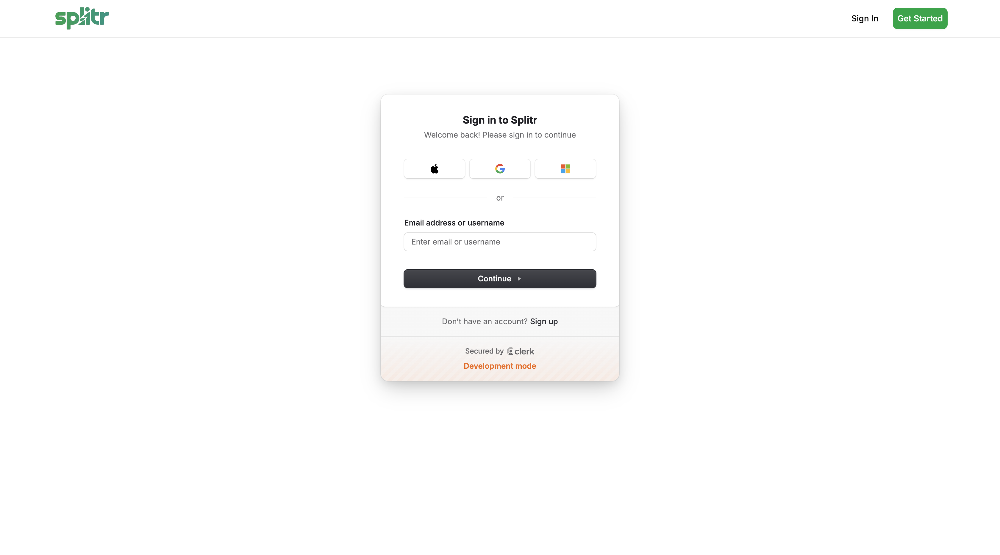
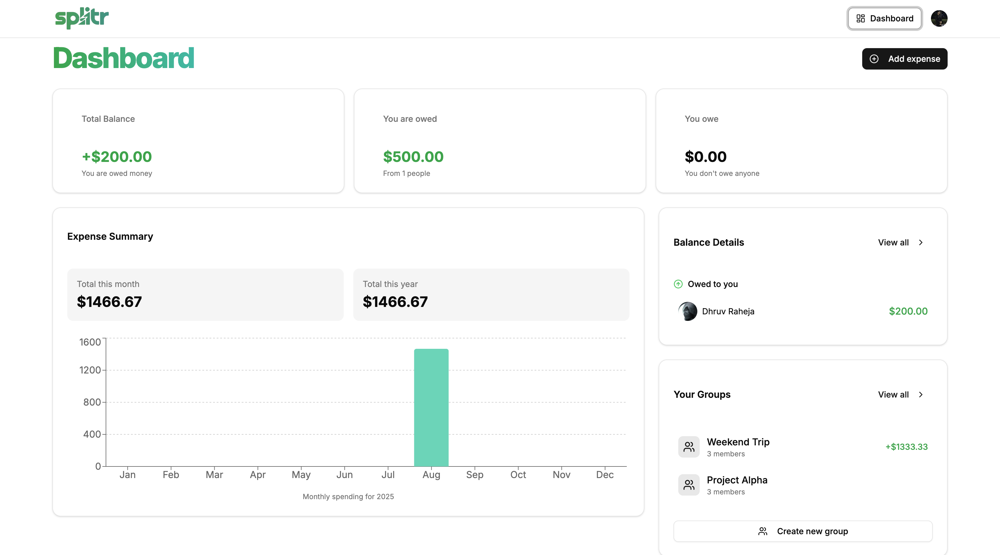
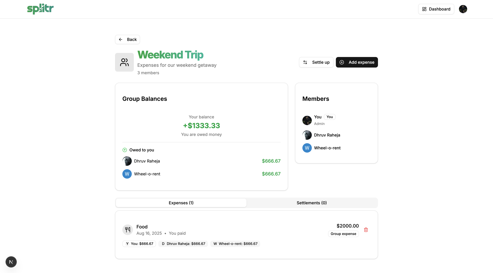
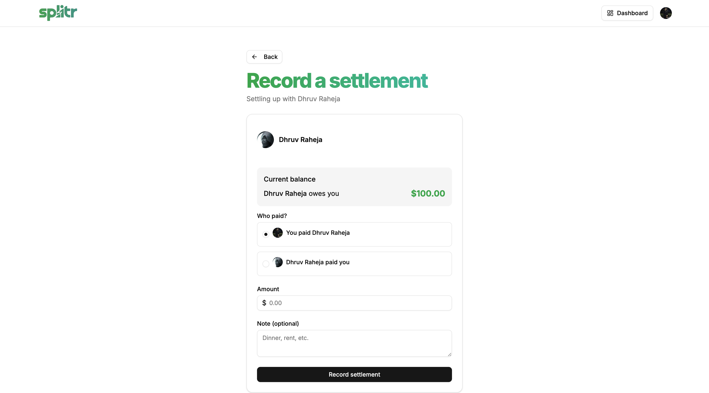

# Splitr

Splitr makes managing shared expenses effortless. Whether you’re splitting rent with roommates, tracking group trip costs, or managing office lunches, Splitr keeps everything transparent and stress-free.

🔗 **Live Demo:** [splitr-gamma-five.vercel.app](https://splitr-gamma-five.vercel.app/)

---

## ✨ Features

- 🔗 **Smart Settlements** – Automatically calculate who owes whom.
- 👥 **Groups & 1-to-1 Expenses** – Manage both group and personal expenses.
- 📊 **Flexible Splits** – Equal, percentage, or exact amounts.
- 🔍 **Quick Search** – Find friends or colleagues instantly.
- 📱 **Responsive Design** – Works seamlessly on desktop and mobile.

---

## 🚀 Tech Stack

- **Frontend:** [Next.js](https://nextjs.org/), [React](https://react.dev/), [Tailwind CSS](https://tailwindcss.com/)
- **Backend & Database:** [Convex](https://convex.dev/)
- **Authentication:** [Clerk](https://clerk.com/)
- **Deployment:** [Vercel](https://vercel.com/)

---

## 🛠️ Getting Started

### 1. Clone the repository

```bash
git clone https://github.com/your-username/splitr.git
cd splitr
```

### 2. Install dependencies

```
bash
npm install
```

### 3. Configure environment variables

Create a .env.local file in the root and add:

```env
# Convex backend deployment
CONVEX_DEPLOY_KEY=prod:<your-deploy-key>
CONVEX_DEPLOYMENT=prod:<your-deployment-id>
NEXT_PUBLIC_CONVEX_URL=https://<your-convex-subdomain>.convex.cloud

# Clerk authentication
NEXT_PUBLIC_CLERK_PUBLISHABLE_KEY=pk_test_<your-publishable-key>
CLERK_SECRET_KEY=sk_test_<your-secret-key>
NEXT_PUBLIC_CLERK_SIGN_IN_URL=/sign-in
NEXT_PUBLIC_CLERK_SIGN_UP_URL=/sign-up
CLERK_JWT_ISSUER_DOMAIN=https://<your-clerk-subdomain>.clerk.accounts.dev

# Email sending via Resend
RESEND_API_KEY=re_<your-resend-api-key>

# Google API key for Gemini or other integrations
GEMINI_API_KEY=<your-google-api-key>
```

### 4. Run the development server

```bash
npm run dev
```

Your app should now be running at http://localhost:3000.

---

📸 Screenshots
Authentication & Onboarding


Dashboard Overview


Group Expense Management


Settlements & Payments


---

Made with ❤️ by Dhruv
